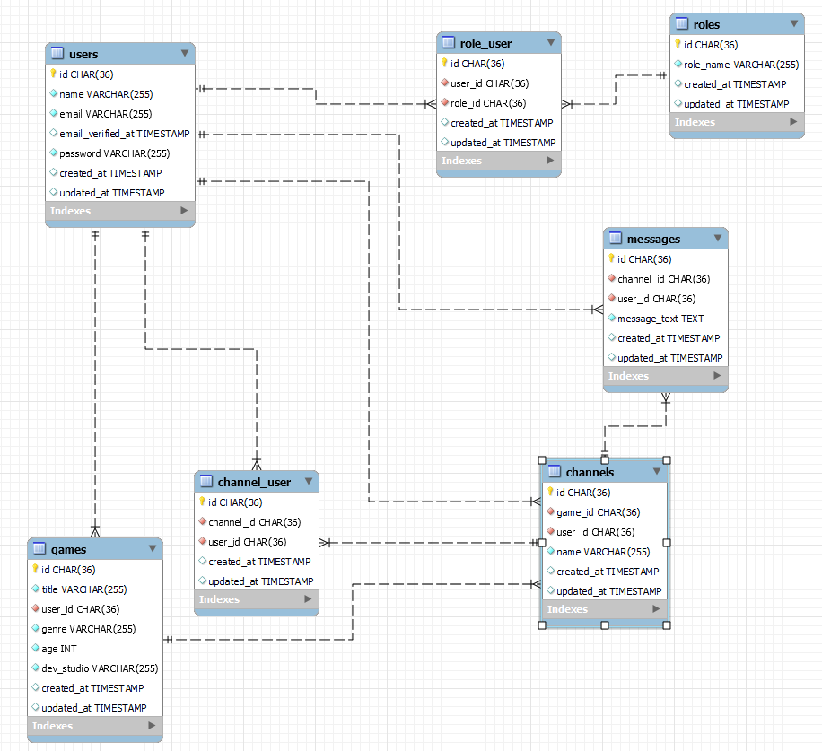

 

<h2> PROYECTO GEEKSHUBS 6: BACKEND DE APLICACIÓN WEB LFG </h2>

#### Definición y alcance:

El objeto de este proyecto con fines de formación, el sexto de los que desarrollamos durante el bootcamp "Full Stack Developer" en GeeksHubs, es la realización de un backend básico en modelo vista-controlador de una aplicación web lfg:  
 
El background es el que sigue:  
Una empresa quiere crear una aplicación web LFG, que permita que los empleados puedan contactar con otros compañeros para formar grupos para jugar a un videojuego, con el objetivo de poder compartir un rato de ocio afterwork.  

Los requisitos funcionales mínimos de la aplicación son los siguientes:  
● Los usuarios se tienen que poder registrar a la aplicación, estableciendo un usuario/contraseña.  
● Los usuarios tienen que autenticarse a la aplicación haciendo login.  
● Los usuarios tienen que poder crear Partídas (grupos) para un determinado videojuego.  
● Los usuarios tienen que poder buscar Partídas seleccionando un videojuego.  
● Los usuarios pueden entrar y salir de una Party.  
● Los usuarios tienen que poder enviar mensajes a la Party. Estos mensajes tienen que poder ser editados y borrados por su usuario creador.  
● Los mensajes que existan en una Party se tienen que visualizar como un chat común.  
● Los usuarios pueden introducir y modificar sus datos de perfil, por ejemplo, su usuario de Steam.  
● Los usuarios tienen que poder hacer logout de la aplicación web.  

● Además, se dispondrá de un CRUD de usuario y administrador con las operaciones básicas.  

#### Tecnologías aplicadas:

Necesario: PHP, Laravel, SQL, MySQL, jsonwebtoken, bcript.  
Muy recomendado: MySQL Workbench, Postman. 

#### Objetivos:

1- En el presente proyecto del Bootcamp Full Stack correspondiente a la parte PHP se espera que el alumno demuestre todos los conocimientos adquiridos en PHP + Laravel.  
2- El alumno ha de realizar una API REST completa con Laravel que cumpla con los requisitos anteriormente planteados.  
3- Realizar un CRUD de usuario adecuado.  
4- Familiarizarse los métodos de Eloquent así como del uso de las colecciones en Laravel.  
5- Despliegue en heroku.com.  

#### Estructura de la base de datos:

Teniendo en cuenta los requisitos antes mencionados, se ha dispuesto que la base de datos será relacional de tipo SQL y contará con 7 tablas / modelos, a saber:  
    ● User, con los datos personales de los usuarios.  
    ● Games, con datos relevantes de los juegos que dispondrán de canales / salas.  
    ● Roles, con los tres tipos de usuario de los que dispondrá la web, véase user, admin y superadmin, que disfrutarán de distintos grados de acceso a las funcionalidades de la web.  
    ● Role_user, la tabla intermedia que indicará los roles asignados a cada usuario.  
    ● Channels, que representa las salas (chats) a las que los usuarios se podrán unir.  
    ● Channel_user, tabla que contiene la información de los usuarios de cada canal.  
    ● Messages, tabla con todos los mensajes de la aplicación.  

 

#### Instrucciones de uso:

● Si se desea clonar el proyecto en un repositorio local:

1- Clonar este proyecto en nuestro repositorio local. Desde consola:  
    git clone https://github.com/AntonioML-sc/Api-web-LFG.git  

2- Instalar las dependencias necesarias incluidas en package.json:  
    composer install  

3- Crear nuestra base de datos en local usando MySQL Workbench (recomendado). En el ejemplo, el nombre es api_web_lfg.  

4- En la carpeta raíz del proyecto encontraremos un archivo llamado .env.example. Copiarlo y renombrarlo como .env. A continuación, debemos editar los tres primeros grupos de variables, en los que indicaremos los datos de la base de datos que acabamos de crear.  

5- En la consola, ejecutar el comando:  
    php artisan jwt:secret  

6- Como consecuencia del paso 5, ahora tendremos una línea nueva en nuestro archivo .env, que incluye la clave de jwt con un valor aleatorio. Se puede editar esta clave si se desea.  

7- Migrar los modelos a la base de datos local:  
    php artisan migrate  

8- Crear los registros necesarios para los roles de usuario en la base de datos usando seeders. Se crean con unos id determinados, de modo que se garantice que los métodos de autentificación que los usan funcionen correctamente:  
    php artisan db:seed  

9- Ejecutar el comando que levantará el servidor:  
    php artisan serve  

Ahora ya podemos realizar peticiones a través de los endpoints (recomendado Postman o bien la extensión thunder en visual studio code).  

10- Se recomienda que lo primero que se haga sea registrar un nuevo usuario (ver endpoints más abajo). Por comodidad, el primer usuario que se crea tendrá los roles de user, admin y superadmin, de modo que todo el resto de funcionalidades ya estén disponibles.  

● Si solo se desea probar la api ya desplegada en heroku, la dirección es:  
    https://aml-mysql-24-07-22-laravel-lfg.herokuapp.com/api/  
SE RUEGA USARLA CON GENTILEZA.  

#### Listado de endpoints:

Dentro del proyecto, las rutas para todos los endpoints y sus requisitos de autenticación se encuentran en el archivo routes/api.php.   

Si se usa en local, la raíz de las url es por defecto: http://localhost:8000/api  

1- Auth:  

- POST /register => Crea un nuevo usuario. Se debe pasar por body, en forma de json, name, email y password. Estos campos deben tener un formato válido y el email no puede estar ya registrado. Si pasa la validación, se creará el nuevo usuario y se facilitarán los datos del nuevo registro y el token para acceder a las funciones que requieren autenticación.  

 

- POST /login => Login de usuario, pasando por body email y password. Si las credenciales son válidas, se proveerá del token necesario para acceder al resto de funciones que exijan autenticación. Para acceder a las funciones que exijan ser admin (o super admin), es necesario que el ese usuario tenga un registro en la tabla role_user en que se le asigna el rol correspondiente.  

- GET /my-profile => (con autenticación) Muestra los datos del perfil del usuario que haya hecho login.  
- POST /logout => (con autenticación) Logout del usuario. Las funciones que exijan autenticación dejarán de estar accesibles.  
- PUT /my-profile/update => (con autenticación) Permite que un usuario modifique algunos de los datos de su cuenta.  
- DELETE /my-profile/delete => (con autenticación) Permite que un usuario elimine por completo su cuenta.  

2- User:  

- POST /join-to-channel => (con autenticación) El usuario se une al canal cuya id se especifique por body. Necesario para poder enviar mensajes a un canal.  
- POST /leave-channel => (con autenticación) El usuario sale del canal cuya id se especifique por body. Ya no podrá enviar mensajes a ese canal.  

 

- POST /user/set-role/{newRole}/{id} => (solo superadmin) Modifica el role del usuario con la id que se indica en la URL. Los valores válidos de newRole son user, admin y superadmin. Al promocionar a superadmin también se consigue admin.  
- GET /users => (solo superadmin) Muestra los datos de todos los usuarios registrados.  
- GET /users/by-id/{userId} => (solo superadmin) Muestra los datos del usuario cuya id se indica en la url.  
- DELETE /users/delete/{user_id} => (solo superadmin) Elimina el registro del usuario cuya id se indica en la url.  

3- Games:  

- GET /games => Muestra los datos de todos los juegos registrados.  
- POST /games/add-game => (solo admin) Registra un nuevo juego en la base de datos, con los campos definidos por body. El título debe ser único.  

 

- PUT /games/update-game/{gameId} => (solo admin) Modifica los datos de un juego ya registrado en la base de datos, con los campos definidos por body y el id del juego por url. El título debe ser único. Solo pued ser llevado a cabo por el admin que registró el juego o bien por cualquier superadmin.  
- DELETE /games/delete-game/{gameId} => (solo admin) Elimina un juego de la base de datos, con id indicado por url. Esta acción solo puede ser llevada a cabo por el admin que registró el juego o bien por cualquier superadmin.  

4- Channels:  

- POST /channels/new-channel=> (con autenticación) Registra un nuevo canal de un juego concreto. Se toma el id del usuario que lo creó, que tendrá algunos privilegios sobre la gestión del canal.  

 

- GET /channels/get-by-game/{game_id} => (con autenticación) Muestra los canales existentes de un juego cuya id se pasa por params, así como la cantidad de usuarios que tiene ya el canal.  

 

- PUT /channels/update/{channelId} => (con autenticación) Modifica algunos de los datos de un canal. Solo puede ser llevado a cabo por el usuario que registró el canal o bien por cualquier admin.  
- DELETE /channels/delete/{channelId} => (con autenticación) Elimina por completo un canal. Solo puede ser llevado a cabo por el usuario que registró el canal o bien por cualquier admin.  

5- Messages:  

- POST /messages/post => (con autenticación) Registra un nuevo mensaje en un canal concreto al que el usuario debe haberse unido previamente.  
- GET /messages/get-by-channel/{channel_id} => (con autenticación) Muestra los mensajes de un canal cuya id se pasa en la url en orden cronológico, así como el nombre del usuario que envió cada mensaje. Para acceder a esta función, el usuario debe haberse unido al canal previamente.  
- PUT /messages/edit/{option}/{msgId} => (con autenticación) Permite al autor de un mensaje modificarlo o borrar el texto del mensaje, según la opción elegida (update / delete). Si el mensaje fue editado, el nuevo texto aparecerá como "Edited: ...". Si el autor quiso eliminarlo, simplemente se mostrará el texto como "Message deleted by user". Por razones de diseño, no se permite a los usuarios eliminar del todo un mensaje, ya que una conversación podría perder la coherencia y ser difícil de seguir.  

#### Bugs conocidos y posibles nuevos trabajos:

- Limpieza y optimización del código. Siempre hay algo que mejorar.  
- Otras peticiones que puedan ser convenientes, así como mejorar la información facilitada en algunas de las existentes.  
- Ampliar y mejorar la validación de datos.  
- Plantearse la conveniencia de una eliminación lógica de los registros en vez de la que se ha implementado.  
- Reunir las variables de entorno en un único archivo.  
- Cualquier sugerencia será bien recibida.  

#### Créditos y agradecimientos:

- A los docentes y compañeros de GeeksHubs por la formación y el ánimo para seguir mejorando.  

#### Tecnologías:

<code></code>
<code></code>
<code></code>
<code></code>
<code></code>
<code></code>
